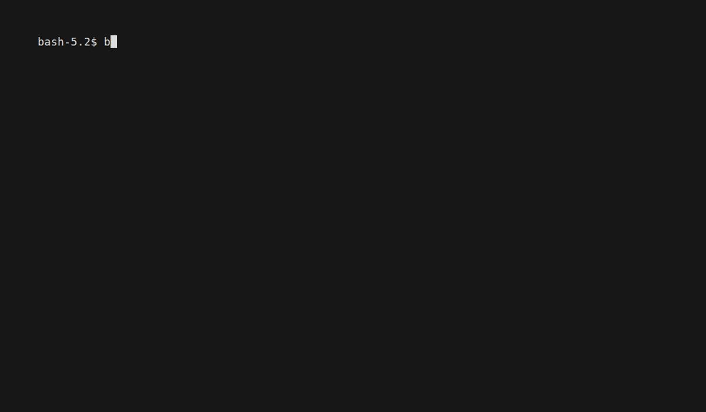

## What is ts-agents?

::: {.big-claim}
CLI + workflows + skills + sandboxes for reproducible time-series automation.
:::

::: {.proof-grid}
::: {.proof-card}
`workflow`

Reproducible end-to-end runs
:::

::: {.proof-card}
`tool`

Direct access to analysis functions
:::

::: {.proof-card}
`skills`

Domain runbooks for agent harnesses
:::

::: {.proof-card}
`sandbox`

Isolation for messy dependencies
:::
:::

::: notes
Open with the practical point: this is a stable execution surface for time-series work that different agent runtimes can drive.
:::

## Why This Matters

::: {.why-layout}
::: {.why-panel}
::: {.column-heading}
Why automate the work?
:::

- Routine analysis consumes expert time: clean data, run baselines, make plots, write reports
- One-off runs hide choices in notebooks, transcripts, and local folders
- Teams need more diagnostics than humans can review line by line
- Automation makes the routine path cheap, repeatable, and ready for expert review
:::

::: {.why-panel .why-panel-accent}
::: {.column-heading}
Why make it a CLI?
:::

- Commands are a stable contract for people, agents, CI, schedulers, and notebooks
- A run can be replayed with the same inputs, flags, environment, and output directory
- JSON envelopes and file artifacts are easier to audit than chat transcripts
- Different orchestrators can call the same workflow without changing the analysis code
:::
:::

::: notes
The core argument is not "use a terminal because developers like terminals." The argument is that repeated analysis needs an executable contract: one command in, typed artifacts out, and a record that another person or system can replay.
:::

## Architecture

::: {.workflow-map}
::: {.map-node}
Agent or script

Codex / Claude / LangChain / CI
:::

::: {.map-edge}
plans and runs
:::

::: {.map-node .map-node-accent}
`ts-agents`

`workflow` · `tool` · `skills` · `sandbox`
:::

::: {.map-edge}
writes
:::

::: {.map-node}
Artifacts

JSON · PNG · CSV · Markdown · manifests
:::
:::

::: {.small-note}
The CLI is intentionally the stable spine. Agents, scripts, notebooks, and CI can all call the same contract.
:::

## Demo 1: Activity Recognition

::: {.demo-layout}
::: {.demo-media}
{.demo-gif fig-alt="Terminal demo running the activity recognition workflow and listing generated artifacts"}
:::

::: {.demo-copy}
::: {.demo-heading}
What happens
:::

- Generate or load a labeled sensor stream
- Sweep candidate window sizes
- Evaluate a windowed classifier
- Write plots and a short report

::: {.artifact-grid}
::: {.artifact}
`window_scores.png`
:::
::: {.artifact}
`confusion_matrix.png`
:::
::: {.artifact}
`report.md`
:::
:::
:::
:::

::: notes
Keep this under 90 seconds. Emphasize that window size is a modeling choice agents often get wrong unless it is encoded in the workflow.
:::

## Demo 2: Forecasting

::: {.demo-layout}
::: {.demo-media}
{.demo-gif fig-alt="Terminal demo running the forecasting workflow and listing generated artifacts"}
:::

::: {.demo-copy}
::: {.demo-heading}
What happens
:::

- Compare baseline forecasting methods
- Rank by holdout metrics
- Save the selected forecast
- Produce report-ready artifacts

::: {.artifact-grid}
::: {.artifact}
`forecast_comparison.png`
:::
::: {.artifact}
`forecast.csv`
:::
::: {.artifact}
`report.md`
:::
:::
:::
:::

::: notes
If the GIF is too fast during delivery, pause on the artifact list and explain why the files matter more than the terminal output.
:::

## Reports Are First-Class

::: {.report-layout}
::: {.report-panel}
::: {.column-heading}
Workflow reports
:::

Each first-class workflow writes a short Markdown report alongside structured outputs.

::: {.command-line}
`ts-agents workflow run forecast-series --output-dir outputs/forecast`
:::

::: {.artifact-grid}
::: {.artifact}
`report.md`
:::
::: {.artifact}
`run_manifest.json`
:::
::: {.artifact}
`forecast.csv`
:::
:::
:::

::: {.report-panel}
::: {.column-heading}
Stakeholder reports
:::

A report-generation skill can turn a run manifest and artifacts into a Quarto or PDF report.

::: {.command-line}
`ts-agents skills show report-generation`
:::

::: {.command-line}
`quarto render outputs/reports/forecast.qmd`
:::
:::
:::

::: {.small-note}
The interaction can be conversational, scheduled, or scripted. The deliverable is the artifact bundle.
:::

## SKILL.md + Mature CLIs

::: {.harness-grid}
::: {.harness-card}
::: {.harness-title}
Start with mature CLI agents
:::

They already provide repo search, command execution, logs, diffs, permissions, background jobs, and resumable sessions.
:::

::: {.harness-card}
::: {.harness-title}
Inject domain expertise with skills
:::

`SKILL.md` files encode tool order, cheap baselines, artifact checks, report expectations, and done criteria.
:::

::: {.harness-card .harness-card-accent}
::: {.harness-title}
Custom agents are still possible
:::

Build a dedicated harness when you need proprietary integrations, strict policies, non-developer workflows, or offline/low-latency deployment.
:::
:::

::: {.small-note}
The practical path is incremental: stable CLI first, skills next, custom harness only when the use case justifies it.
:::

## Lesson: Tool Selection Needs Priors

::: {.lesson-split}
::: {.lesson-pain}
::: {.lesson-title}
Pain point
:::

When many similar tools exist, agents often jump to expensive or fragile methods before checking cheap baselines.
:::

::: {.lesson-fix}
::: {.lesson-title}
How ts-agents helps
:::

Tool metadata, bundles, and skills make the intended order explicit: cheap baselines, robust defaults, then advanced methods.
:::
:::

::: {.small-note}
This matters for forecasting, classification, anomaly detection, and any workflow with multiple plausible algorithms.
:::

## Lesson: Long-Running Loops Break Chat

::: {.lesson-split}
::: {.lesson-pain}
::: {.lesson-title}
Pain point
:::

Minutes-to-hours jobs need progress, logs, retry behavior, review checkpoints, and resumable state.
:::

::: {.lesson-fix}
::: {.lesson-title}
How ts-agents helps
:::

Run-scoped output directories, manifests, artifact refs, cost metadata, and sandbox hooks make jobs batch-friendly.
:::
:::

::: {.small-note}
The roadmap is to push this further: async execution, queue/progress/cancel/resume, and richer run history.
:::

## Lesson: Dependencies Need Sandboxes

::: {.lesson-split}
::: {.lesson-pain}
::: {.lesson-title}
Pain point
:::

Time-series stacks are fragmented: optional libraries, compiled dependencies, version conflicts, and cloud/local differences.
:::

::: {.lesson-fix}
::: {.lesson-title}
How ts-agents helps
:::

Keep imports lazy, detect install profiles, and use sandbox backends for isolation, reproducibility, and heavier workloads.
:::
:::

::: {.small-note}
Sandboxes are not magic: data gravity, cold starts, cost governance, and infrastructure debugging still matter.
:::

## What Works Now

::: {.status-grid}
::: {.status-card .status-good}
::: {.status-title}
Stable surfaces
:::

`capabilities`, `workflow show`, strict JSON envelopes, typed artifacts
:::

::: {.status-card .status-good}
::: {.status-title}
Demo-ready workflows
:::

Inspection, forecasting, activity recognition
:::

::: {.status-card .status-good}
::: {.status-title}
Agent-friendly outputs
:::

Run manifests, non-clobbering output dirs, artifact refs
:::

::: {.status-card .status-good}
::: {.status-title}
Integration paths
:::

LangChain wrappers, deep-agent path, packaged skills, mature CLI agents
:::
:::

## Use Cases: Industry and Research

::: {.industry-grid}
::: {.industry-card}
::: {.industry-title}
Process industry
:::

Supplement simulation forecasts, scan sensor fields, flag anomalies, and summarize operating regimes.
:::

::: {.industry-card}
::: {.industry-title}
Live or batched data
:::

Run scheduled diagnostics, forecast refreshes, quality checks, and report generation over streaming or daily batch data.
:::

::: {.industry-card}
::: {.industry-title}
Research teams
:::

Compare experiments with repeatable commands, preserve artifact trails, and turn repeated analyses into reusable skills.
:::

::: {.industry-card}
::: {.industry-title}
Custom harnesses
:::

Use `ts-agents` as one callable subsystem inside a larger orchestrator with governance, data access, and review.
:::
:::

## Roadmap: Autoresearch Loop

  

Orchestrator

plans · routes · reviews

  

Data

digital twins · telemetry · simulations

  

Tools (ts-agents)

CLIs · MCP

  

Evaluation

rubrics · metrics · reviewer signal

  
Loop: Orchestrator → Data → Tools (ts-agents) → Evaluation → back to Orchestrator

::: {.roadmap-bullets}
- Run simulation campaigns and large analysis batches without inspecting every intermediate file.
- Feed outcomes, artifacts, failed tool choices, and review decisions back into better orchestrator policies.
:::

## Autoresearch vs Policy Gradient

::: {.research-compare}
::: {.research-card .policy-card}
::: {.research-title}
Policy gradient
:::

- The orchestrator samples actions
- A reward function scores behavior
- Optimizer updates orchestrator weights

::: {.research-focus}
Learns inside the policy.
:::
:::

::: {.research-card .autoresearch-card}
::: {.research-title}
Autoresearch
:::

- The LLM reads metrics, figures, reports, and traces
- It proposes a hypothesis and next experiment
- It can revise plans, skills, tools, and training data

::: {.research-focus}
Learns through artifacts and workflow changes.
:::
:::
:::

::: {.trace-panel}
::: {.trace-title}
Simple examples
:::

::: {.example-grid}
::: {.trace-step}
**Policy gradient:** sample workflow choices, reward lower validation RMSE, then update orchestrator weights toward actions that picked better methods.
:::

::: {.trace-step}
**Autoresearch:** Iteration 0 finds Theta wins on metrics, but the figure shows drift and the report flags short validation. Iteration 1 runs decomposition, widens baselines, and updates the forecasting skill.
:::
:::

::: {.trace-note}
Autoresearch can improve the orchestrator, but also the surrounding skill files, tool metadata, eval rubrics, and reusable workflow defaults.
:::
:::

## Personalized Agents: OpenClaw / Hermes + ts-agents

::: {.lesson-split}
::: {.lesson-pain}
::: {.lesson-title}
What the agent remembers
:::

- Preferred analysis order: inspect first, cheap baselines next, advanced methods only when justified
- Domain defaults: variables, time scales, quality checks, missing-data tolerance, validation style
- Communication preferences: executive summary, research appendix, plots to prioritize, caveats to call out
:::

::: {.lesson-fix}
::: {.lesson-title}
Where `ts-agents` fits
:::

- OpenClaw / Hermes-style agents provide persistent memory, scheduling, and personalization
- `ts-agents` turns remembered preferences into repeatable workflow commands and artifact checks
- Enterprise form factor: governed personal/team agents calling vetted CLIs in sandboxes with approvals, logs, and artifact stores
:::
:::

::: {.small-note}
The personal agent learns the user's data-science playbook; `ts-agents` keeps each run auditable and reproducible.
:::

::: notes
OpenClaw and Hermes point to the same product shape: an agent that lives where the user already works, keeps memory across sessions, invokes tools, and runs unattended automations. Combined with `ts-agents`, that memory can shape analysis choices: which baselines to start with, how conservative validation should be, which plots are expected, and what level of reporting the user prefers. The enterprise version is a governed worker inside a trust boundary, calling explicit capabilities such as `ts-agents workflow run forecast-series` and producing auditable artifacts.
:::

## Takeaways {.center}

::: {.takeaways}

1. **Use the CLI as the durable contract** across agents, scripts, and CI.

2. **Treat artifacts as the product**: plots, JSON, CSV, reports, and manifests.

3. **Pair skills with memory** so personalized agents choose methods, checks, and reporting style consistently.
:::

::: {.small-note}
Closing thought: `ts-agents` is strongest as a specialist subsystem inside a larger governed agent workflow.
:::

## Thanks! {.center}

::: {.repo-callout}
Open source repo

**[github.com/fnauman/ts-agents](https://github.com/fnauman/ts-agents)**
:::

::: {.small-note}
Docs, examples, skills, and demo scripts are in the repository.
:::
